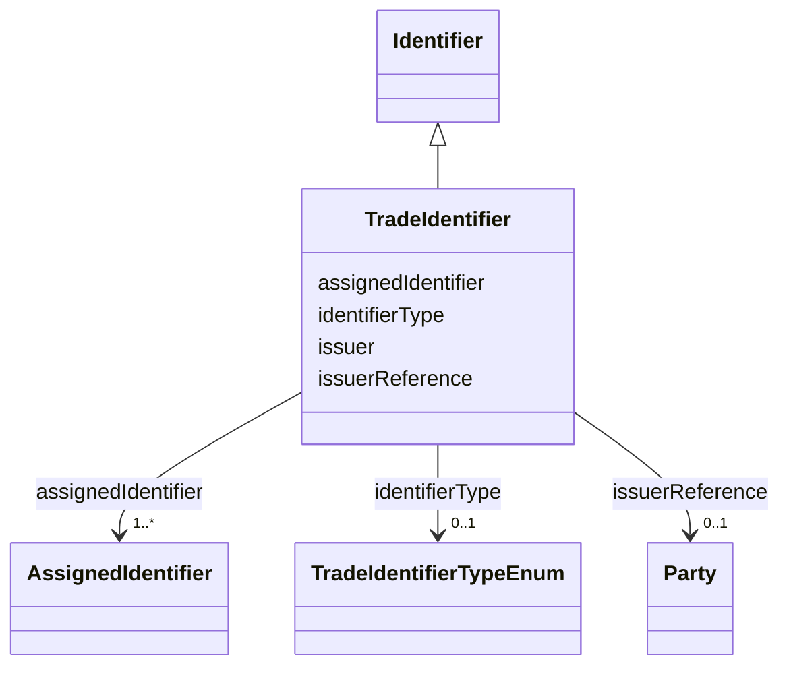

```mermaid
 classDiagram
    class TradeIdentifier
    click TradeIdentifier href "../TradeIdentifier"
      Identifier <|-- TradeIdentifier
        click Identifier href "../Identifier"
      
      TradeIdentifier : assignedIdentifier
        
          
    
        
        
        TradeIdentifier --> "1..*" AssignedIdentifier : assignedIdentifier
        click AssignedIdentifier href "../AssignedIdentifier"
    

        
      TradeIdentifier : identifierType
        
          
    
        
        
        TradeIdentifier --> "0..1" TradeIdentifierTypeEnum : identifierType
        click TradeIdentifierTypeEnum href "../TradeIdentifierTypeEnum"
    

        
      TradeIdentifier : issuer
        
      TradeIdentifier : issuerReference
        
          
    
        
        
        TradeIdentifier --> "0..1" Party : issuerReference
        click Party href "../Party"
    

        
      
```
