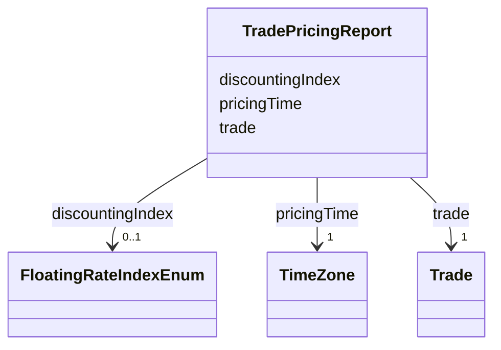

```mermaid
 classDiagram
    class TradePricingReport
    click TradePricingReport href "../TradePricingReport"
      TradePricingReport : discountingIndex
        
          
    
        
        
        TradePricingReport --> "0..1" FloatingRateIndexEnum : discountingIndex
        click FloatingRateIndexEnum href "../FloatingRateIndexEnum"
    

        
      TradePricingReport : pricingTime
        
          
    
        
        
        TradePricingReport --> "1" TimeZone : pricingTime
        click TimeZone href "../TimeZone"
    

        
      TradePricingReport : trade
        
          
    
        
        
        TradePricingReport --> "1" Trade : trade
        click Trade href "../Trade"
    

        
      
```
