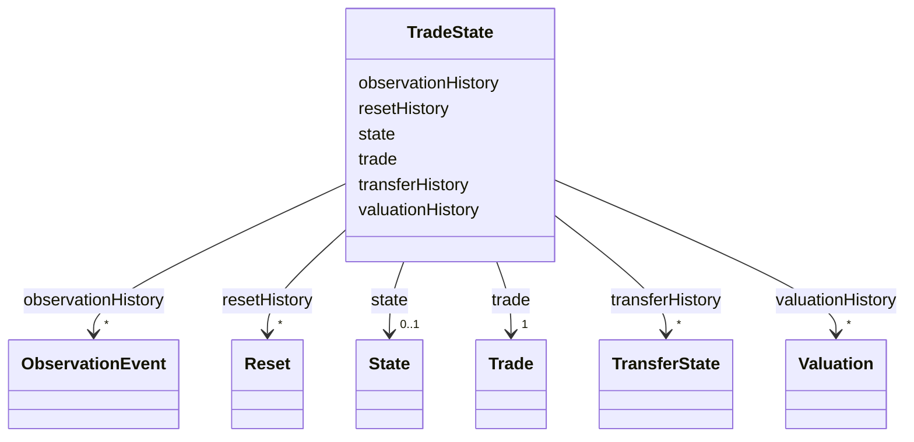

```mermaid
 classDiagram
    class TradeState
    click TradeState href "../TradeState"
      TradeState : observationHistory
        
          
    
        
        
        TradeState --> "*" ObservationEvent : observationHistory
        click ObservationEvent href "../ObservationEvent"
    

        
      TradeState : resetHistory
        
          
    
        
        
        TradeState --> "*" Reset : resetHistory
        click Reset href "../Reset"
    

        
      TradeState : state
        
          
    
        
        
        TradeState --> "0..1" State : state
        click State href "../State"
    

        
      TradeState : trade
        
          
    
        
        
        TradeState --> "1" Trade : trade
        click Trade href "../Trade"
    

        
      TradeState : transferHistory
        
          
    
        
        
        TradeState --> "*" TransferState : transferHistory
        click TransferState href "../TransferState"
    

        
      TradeState : valuationHistory
        
          
    
        
        
        TradeState --> "*" Valuation : valuationHistory
        click Valuation href "../Valuation"
    

        
      
```
