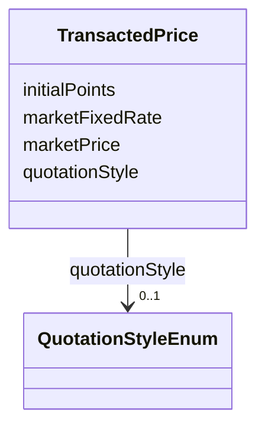

```mermaid
 classDiagram
    class TransactedPrice
    click TransactedPrice href "../TransactedPrice"
      TransactedPrice : initialPoints
        
      TransactedPrice : marketFixedRate
        
      TransactedPrice : marketPrice
        
      TransactedPrice : quotationStyle
        
          
    
        
        
        TransactedPrice --> "0..1" QuotationStyleEnum : quotationStyle
        click QuotationStyleEnum href "../QuotationStyleEnum"
    

        
      
```
