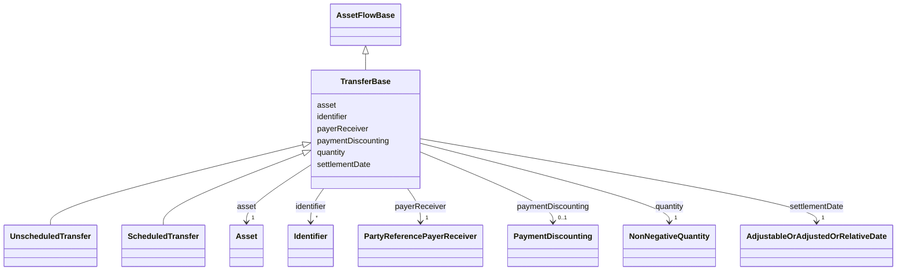

```mermaid
 classDiagram
    class TransferBase
    click TransferBase href "../TransferBase"
      AssetFlowBase <|-- TransferBase
        click AssetFlowBase href "../AssetFlowBase"
      

      TransferBase <|-- UnscheduledTransfer
        click UnscheduledTransfer href "../UnscheduledTransfer"
      TransferBase <|-- ScheduledTransfer
        click ScheduledTransfer href "../ScheduledTransfer"
      

      TransferBase : asset
        
          
    
        
        
        TransferBase --> "1" Asset : asset
        click Asset href "../Asset"
    

        
      TransferBase : identifier
        
          
    
        
        
        TransferBase --> "*" Identifier : identifier
        click Identifier href "../Identifier"
    

        
      TransferBase : payerReceiver
        
          
    
        
        
        TransferBase --> "1" PartyReferencePayerReceiver : payerReceiver
        click PartyReferencePayerReceiver href "../PartyReferencePayerReceiver"
    

        
      TransferBase : paymentDiscounting
        
          
    
        
        
        TransferBase --> "0..1" PaymentDiscounting : paymentDiscounting
        click PaymentDiscounting href "../PaymentDiscounting"
    

        
      TransferBase : quantity
        
          
    
        
        
        TransferBase --> "1" NonNegativeQuantity : quantity
        click NonNegativeQuantity href "../NonNegativeQuantity"
    

        
      TransferBase : settlementDate
        
          
    
        
        
        TransferBase --> "1" AdjustableOrAdjustedOrRelativeDate : settlementDate
        click AdjustableOrAdjustedOrRelativeDate href "../AdjustableOrAdjustedOrRelativeDate"
    

        
      
```
