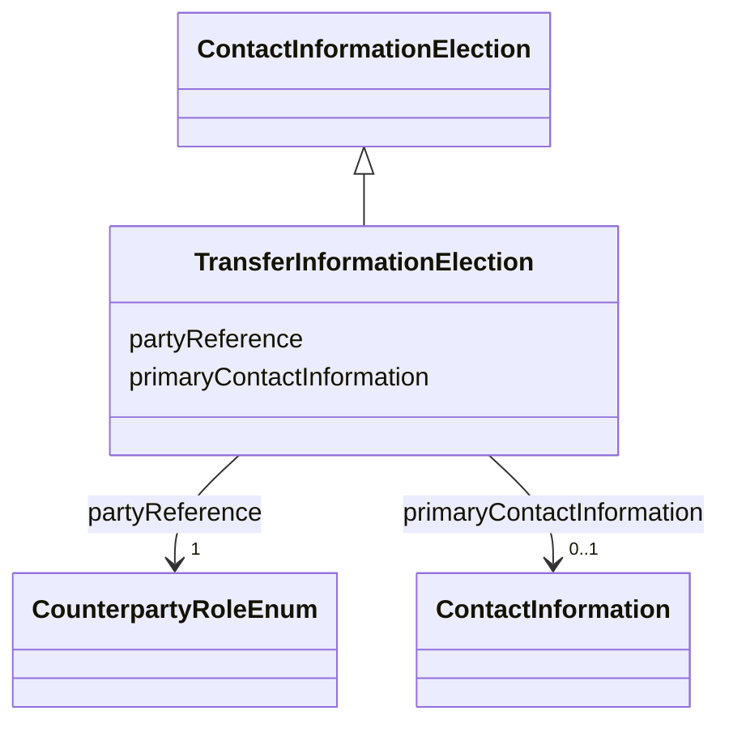

```mermaid
 classDiagram
    class TransferInformationElection
    click TransferInformationElection href "../TransferInformationElection"
      ContactInformationElection <|-- TransferInformationElection
        click ContactInformationElection href "../ContactInformationElection"
      
      TransferInformationElection : partyReference
        
          
    
        
        
        TransferInformationElection --> "1" CounterpartyRoleEnum : partyReference
        click CounterpartyRoleEnum href "../CounterpartyRoleEnum"
    

        
      TransferInformationElection : primaryContactInformation
        
          
    
        
        
        TransferInformationElection --> "0..1" ContactInformation : primaryContactInformation
        click ContactInformation href "../ContactInformation"
    

        
      
```
