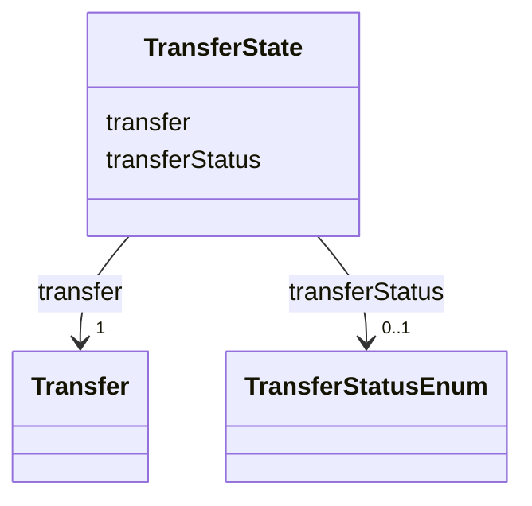

```mermaid
 classDiagram
    class TransferState
    click TransferState href "../TransferState"
      TransferState : transfer
        
          
    
        
        
        TransferState --> "1" Transfer : transfer
        click Transfer href "../Transfer"
    

        
      TransferState : transferStatus
        
          
    
        
        
        TransferState --> "0..1" TransferStatusEnum : transferStatus
        click TransferStatusEnum href "../TransferStatusEnum"
    

        
      
```
