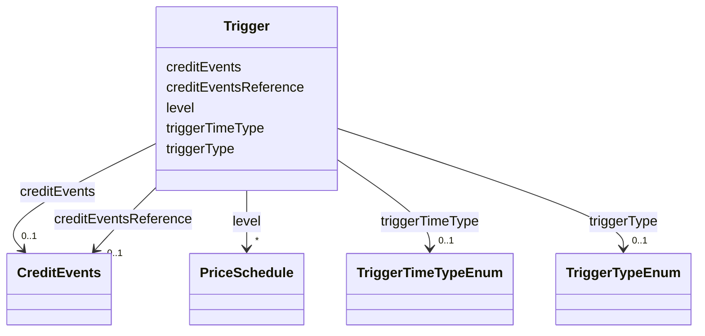

```mermaid
 classDiagram
    class Trigger
    click Trigger href "../Trigger"
      Trigger : creditEvents
        
          
    
        
        
        Trigger --> "0..1" CreditEvents : creditEvents
        click CreditEvents href "../CreditEvents"
    

        
      Trigger : creditEventsReference
        
          
    
        
        
        Trigger --> "0..1" CreditEvents : creditEventsReference
        click CreditEvents href "../CreditEvents"
    

        
      Trigger : level
        
          
    
        
        
        Trigger --> "*" PriceSchedule : level
        click PriceSchedule href "../PriceSchedule"
    

        
      Trigger : triggerTimeType
        
          
    
        
        
        Trigger --> "0..1" TriggerTimeTypeEnum : triggerTimeType
        click TriggerTimeTypeEnum href "../TriggerTimeTypeEnum"
    

        
      Trigger : triggerType
        
          
    
        
        
        Trigger --> "0..1" TriggerTypeEnum : triggerType
        click TriggerTypeEnum href "../TriggerTypeEnum"
    

        
      
```
