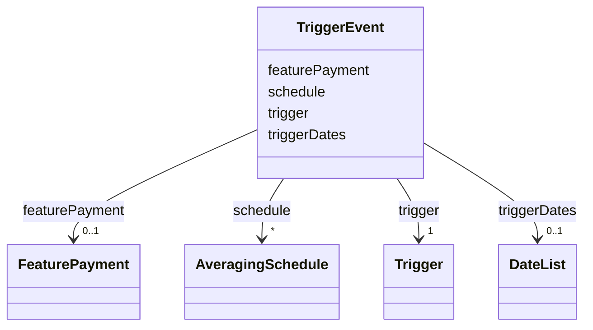

```mermaid
 classDiagram
    class TriggerEvent
    click TriggerEvent href "../TriggerEvent"
      TriggerEvent : featurePayment
        
          
    
        
        
        TriggerEvent --> "0..1" FeaturePayment : featurePayment
        click FeaturePayment href "../FeaturePayment"
    

        
      TriggerEvent : schedule
        
          
    
        
        
        TriggerEvent --> "*" AveragingSchedule : schedule
        click AveragingSchedule href "../AveragingSchedule"
    

        
      TriggerEvent : trigger
        
          
    
        
        
        TriggerEvent --> "1" Trigger : trigger
        click Trigger href "../Trigger"
    

        
      TriggerEvent : triggerDates
        
          
    
        
        
        TriggerEvent --> "0..1" DateList : triggerDates
        click DateList href "../DateList"
    

        
      
```
