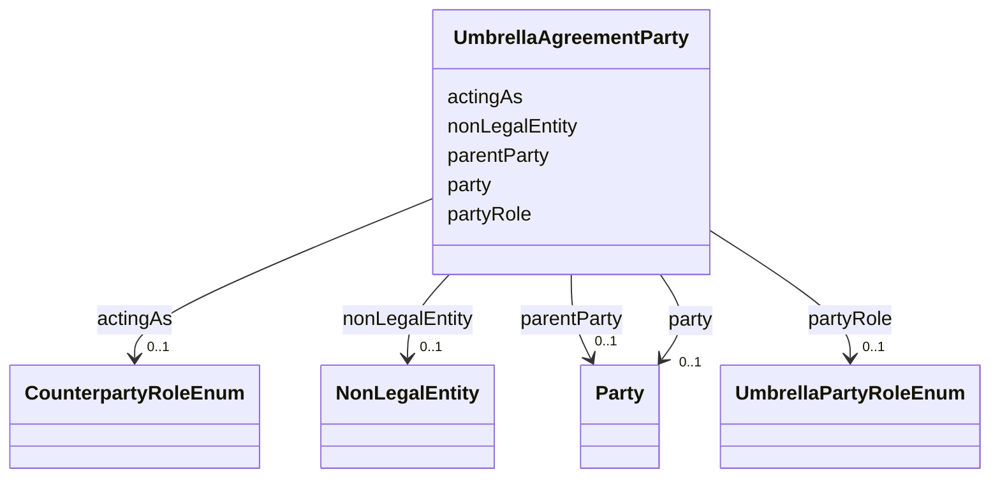

```mermaid
 classDiagram
    class UmbrellaAgreementParty
    click UmbrellaAgreementParty href "../UmbrellaAgreementParty"
      UmbrellaAgreementParty : actingAs
        
          
    
        
        
        UmbrellaAgreementParty --> "0..1" CounterpartyRoleEnum : actingAs
        click CounterpartyRoleEnum href "../CounterpartyRoleEnum"
    

        
      UmbrellaAgreementParty : nonLegalEntity
        
          
    
        
        
        UmbrellaAgreementParty --> "0..1" NonLegalEntity : nonLegalEntity
        click NonLegalEntity href "../NonLegalEntity"
    

        
      UmbrellaAgreementParty : parentParty
        
          
    
        
        
        UmbrellaAgreementParty --> "0..1" Party : parentParty
        click Party href "../Party"
    

        
      UmbrellaAgreementParty : party
        
          
    
        
        
        UmbrellaAgreementParty --> "0..1" Party : party
        click Party href "../Party"
    

        
      UmbrellaAgreementParty : partyRole
        
          
    
        
        
        UmbrellaAgreementParty --> "0..1" UmbrellaPartyRoleEnum : partyRole
        click UmbrellaPartyRoleEnum href "../UmbrellaPartyRoleEnum"
    

        
      
```
