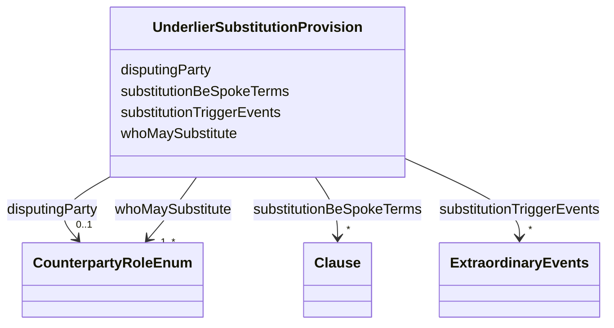

```mermaid
 classDiagram
    class UnderlierSubstitutionProvision
    click UnderlierSubstitutionProvision href "../UnderlierSubstitutionProvision"
      UnderlierSubstitutionProvision : disputingParty
        
          
    
        
        
        UnderlierSubstitutionProvision --> "0..1" CounterpartyRoleEnum : disputingParty
        click CounterpartyRoleEnum href "../CounterpartyRoleEnum"
    

        
      UnderlierSubstitutionProvision : substitutionBeSpokeTerms
        
          
    
        
        
        UnderlierSubstitutionProvision --> "*" Clause : substitutionBeSpokeTerms
        click Clause href "../Clause"
    

        
      UnderlierSubstitutionProvision : substitutionTriggerEvents
        
          
    
        
        
        UnderlierSubstitutionProvision --> "*" ExtraordinaryEvents : substitutionTriggerEvents
        click ExtraordinaryEvents href "../ExtraordinaryEvents"
    

        
      UnderlierSubstitutionProvision : whoMaySubstitute
        
          
    
        
        
        UnderlierSubstitutionProvision --> "1..*" CounterpartyRoleEnum : whoMaySubstitute
        click CounterpartyRoleEnum href "../CounterpartyRoleEnum"
    

        
      
```
