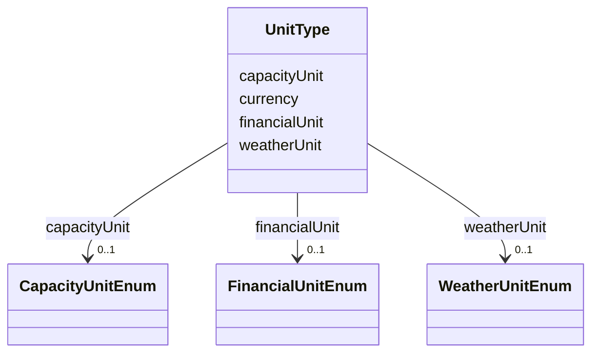

```mermaid
 classDiagram
    class UnitType
    click UnitType href "../UnitType"
      UnitType : capacityUnit
        
          
    
        
        
        UnitType --> "0..1" CapacityUnitEnum : capacityUnit
        click CapacityUnitEnum href "../CapacityUnitEnum"
    

        
      UnitType : currency
        
      UnitType : financialUnit
        
          
    
        
        
        UnitType --> "0..1" FinancialUnitEnum : financialUnit
        click FinancialUnitEnum href "../FinancialUnitEnum"
    

        
      UnitType : weatherUnit
        
          
    
        
        
        UnitType --> "0..1" WeatherUnitEnum : weatherUnit
        click WeatherUnitEnum href "../WeatherUnitEnum"
    

        
      
```
