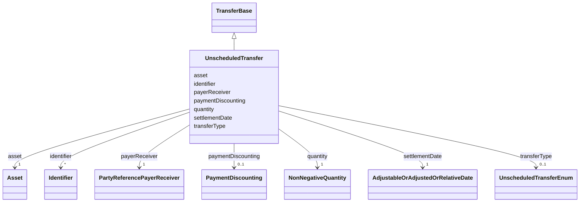

```mermaid
 classDiagram
    class UnscheduledTransfer
    click UnscheduledTransfer href "../UnscheduledTransfer"
      TransferBase <|-- UnscheduledTransfer
        click TransferBase href "../TransferBase"
      
      UnscheduledTransfer : asset
        
          
    
        
        
        UnscheduledTransfer --> "1" Asset : asset
        click Asset href "../Asset"
    

        
      UnscheduledTransfer : identifier
        
          
    
        
        
        UnscheduledTransfer --> "*" Identifier : identifier
        click Identifier href "../Identifier"
    

        
      UnscheduledTransfer : payerReceiver
        
          
    
        
        
        UnscheduledTransfer --> "1" PartyReferencePayerReceiver : payerReceiver
        click PartyReferencePayerReceiver href "../PartyReferencePayerReceiver"
    

        
      UnscheduledTransfer : paymentDiscounting
        
          
    
        
        
        UnscheduledTransfer --> "0..1" PaymentDiscounting : paymentDiscounting
        click PaymentDiscounting href "../PaymentDiscounting"
    

        
      UnscheduledTransfer : quantity
        
          
    
        
        
        UnscheduledTransfer --> "1" NonNegativeQuantity : quantity
        click NonNegativeQuantity href "../NonNegativeQuantity"
    

        
      UnscheduledTransfer : settlementDate
        
          
    
        
        
        UnscheduledTransfer --> "1" AdjustableOrAdjustedOrRelativeDate : settlementDate
        click AdjustableOrAdjustedOrRelativeDate href "../AdjustableOrAdjustedOrRelativeDate"
    

        
      UnscheduledTransfer : transferType
        
          
    
        
        
        UnscheduledTransfer --> "0..1" UnscheduledTransferEnum : transferType
        click UnscheduledTransferEnum href "../UnscheduledTransferEnum"
    

        
      
```
