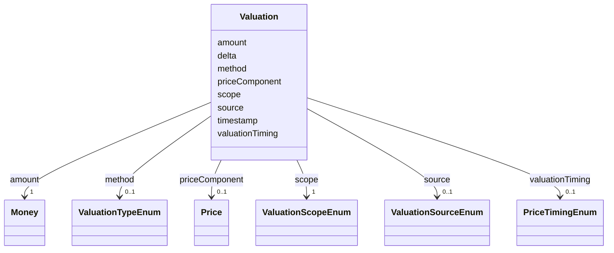

```mermaid
 classDiagram
    class Valuation
    click Valuation href "../Valuation"
      Valuation : amount
        
          
    
        
        
        Valuation --> "1" Money : amount
        click Money href "../Money"
    

        
      Valuation : delta
        
      Valuation : method
        
          
    
        
        
        Valuation --> "0..1" ValuationTypeEnum : method
        click ValuationTypeEnum href "../ValuationTypeEnum"
    

        
      Valuation : priceComponent
        
          
    
        
        
        Valuation --> "0..1" Price : priceComponent
        click Price href "../Price"
    

        
      Valuation : scope
        
          
    
        
        
        Valuation --> "1" ValuationScopeEnum : scope
        click ValuationScopeEnum href "../ValuationScopeEnum"
    

        
      Valuation : source
        
          
    
        
        
        Valuation --> "0..1" ValuationSourceEnum : source
        click ValuationSourceEnum href "../ValuationSourceEnum"
    

        
      Valuation : timestamp
        
      Valuation : valuationTiming
        
          
    
        
        
        Valuation --> "0..1" PriceTimingEnum : valuationTiming
        click PriceTimingEnum href "../PriceTimingEnum"
    

        
      
```
