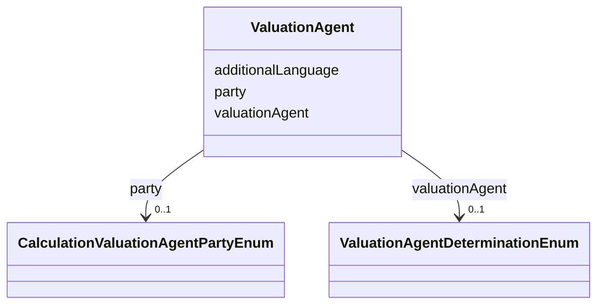

```mermaid
 classDiagram
    class ValuationAgent
    click ValuationAgent href "../ValuationAgent"
      ValuationAgent : additionalLanguage
        
      ValuationAgent : party
        
          
    
        
        
        ValuationAgent --> "0..1" CalculationValuationAgentPartyEnum : party
        click CalculationValuationAgentPartyEnum href "../CalculationValuationAgentPartyEnum"
    

        
      ValuationAgent : valuationAgent
        
          
    
        
        
        ValuationAgent --> "0..1" ValuationAgentDeterminationEnum : valuationAgent
        click ValuationAgentDeterminationEnum href "../ValuationAgentDeterminationEnum"
    

        
      
```
