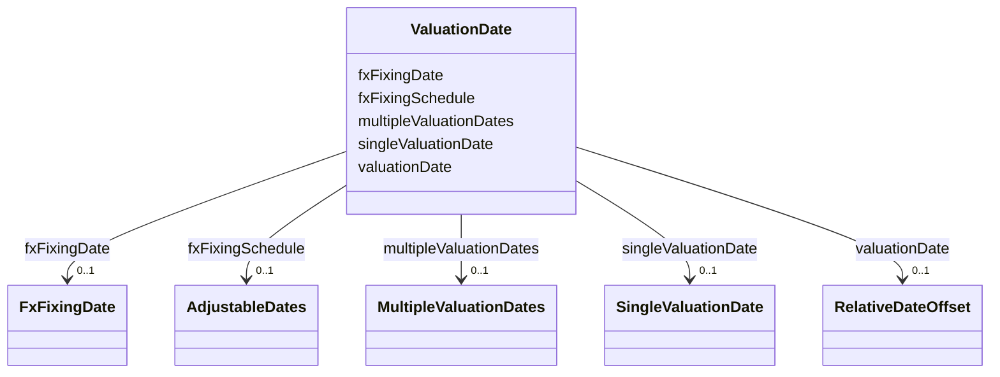

```mermaid
 classDiagram
    class ValuationDate
    click ValuationDate href "../ValuationDate"
      ValuationDate : fxFixingDate
        
          
    
        
        
        ValuationDate --> "0..1" FxFixingDate : fxFixingDate
        click FxFixingDate href "../FxFixingDate"
    

        
      ValuationDate : fxFixingSchedule
        
          
    
        
        
        ValuationDate --> "0..1" AdjustableDates : fxFixingSchedule
        click AdjustableDates href "../AdjustableDates"
    

        
      ValuationDate : multipleValuationDates
        
          
    
        
        
        ValuationDate --> "0..1" MultipleValuationDates : multipleValuationDates
        click MultipleValuationDates href "../MultipleValuationDates"
    

        
      ValuationDate : singleValuationDate
        
          
    
        
        
        ValuationDate --> "0..1" SingleValuationDate : singleValuationDate
        click SingleValuationDate href "../SingleValuationDate"
    

        
      ValuationDate : valuationDate
        
          
    
        
        
        ValuationDate --> "0..1" RelativeDateOffset : valuationDate
        click RelativeDateOffset href "../RelativeDateOffset"
    

        
      
```
