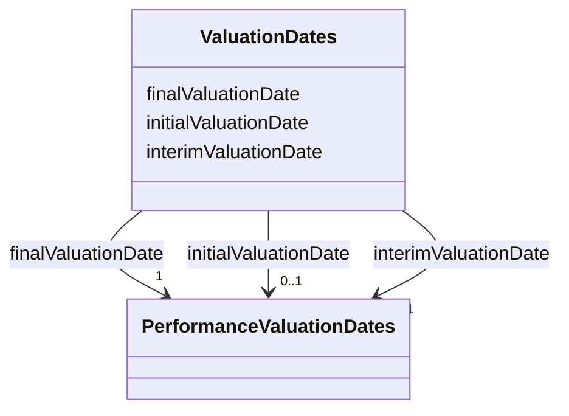

```mermaid
 classDiagram
    class ValuationDates
    click ValuationDates href "../ValuationDates"
      ValuationDates : finalValuationDate
        
          
    
        
        
        ValuationDates --> "1" PerformanceValuationDates : finalValuationDate
        click PerformanceValuationDates href "../PerformanceValuationDates"
    

        
      ValuationDates : initialValuationDate
        
          
    
        
        
        ValuationDates --> "0..1" PerformanceValuationDates : initialValuationDate
        click PerformanceValuationDates href "../PerformanceValuationDates"
    

        
      ValuationDates : interimValuationDate
        
          
    
        
        
        ValuationDates --> "0..1" PerformanceValuationDates : interimValuationDate
        click PerformanceValuationDates href "../PerformanceValuationDates"
    

        
      
```
