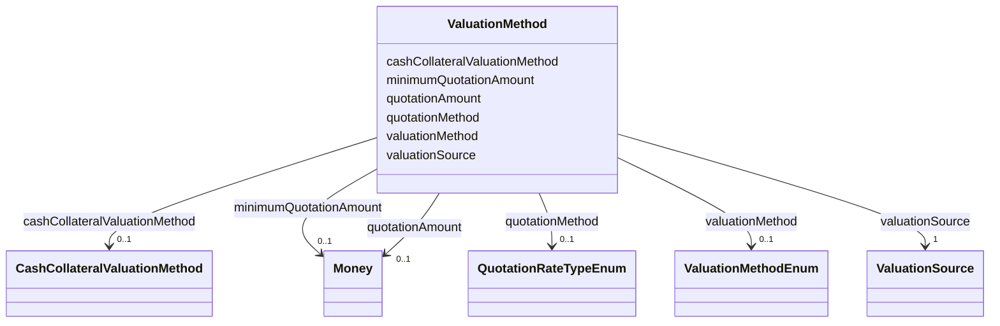

```mermaid
 classDiagram
    class ValuationMethod
    click ValuationMethod href "../ValuationMethod"
      ValuationMethod : cashCollateralValuationMethod
        
          
    
        
        
        ValuationMethod --> "0..1" CashCollateralValuationMethod : cashCollateralValuationMethod
        click CashCollateralValuationMethod href "../CashCollateralValuationMethod"
    

        
      ValuationMethod : minimumQuotationAmount
        
          
    
        
        
        ValuationMethod --> "0..1" Money : minimumQuotationAmount
        click Money href "../Money"
    

        
      ValuationMethod : quotationAmount
        
          
    
        
        
        ValuationMethod --> "0..1" Money : quotationAmount
        click Money href "../Money"
    

        
      ValuationMethod : quotationMethod
        
          
    
        
        
        ValuationMethod --> "0..1" QuotationRateTypeEnum : quotationMethod
        click QuotationRateTypeEnum href "../QuotationRateTypeEnum"
    

        
      ValuationMethod : valuationMethod
        
          
    
        
        
        ValuationMethod --> "0..1" ValuationMethodEnum : valuationMethod
        click ValuationMethodEnum href "../ValuationMethodEnum"
    

        
      ValuationMethod : valuationSource
        
          
    
        
        
        ValuationMethod --> "1" ValuationSource : valuationSource
        click ValuationSource href "../ValuationSource"
    

        
      
```
