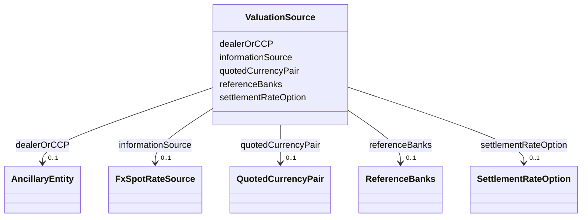

```mermaid
 classDiagram
    class ValuationSource
    click ValuationSource href "../ValuationSource"
      ValuationSource : dealerOrCCP
        
          
    
        
        
        ValuationSource --> "0..1" AncillaryEntity : dealerOrCCP
        click AncillaryEntity href "../AncillaryEntity"
    

        
      ValuationSource : informationSource
        
          
    
        
        
        ValuationSource --> "0..1" FxSpotRateSource : informationSource
        click FxSpotRateSource href "../FxSpotRateSource"
    

        
      ValuationSource : quotedCurrencyPair
        
          
    
        
        
        ValuationSource --> "0..1" QuotedCurrencyPair : quotedCurrencyPair
        click QuotedCurrencyPair href "../QuotedCurrencyPair"
    

        
      ValuationSource : referenceBanks
        
          
    
        
        
        ValuationSource --> "0..1" ReferenceBanks : referenceBanks
        click ReferenceBanks href "../ReferenceBanks"
    

        
      ValuationSource : settlementRateOption
        
          
    
        
        
        ValuationSource --> "0..1" SettlementRateOption : settlementRateOption
        click SettlementRateOption href "../SettlementRateOption"
    

        
      
```
