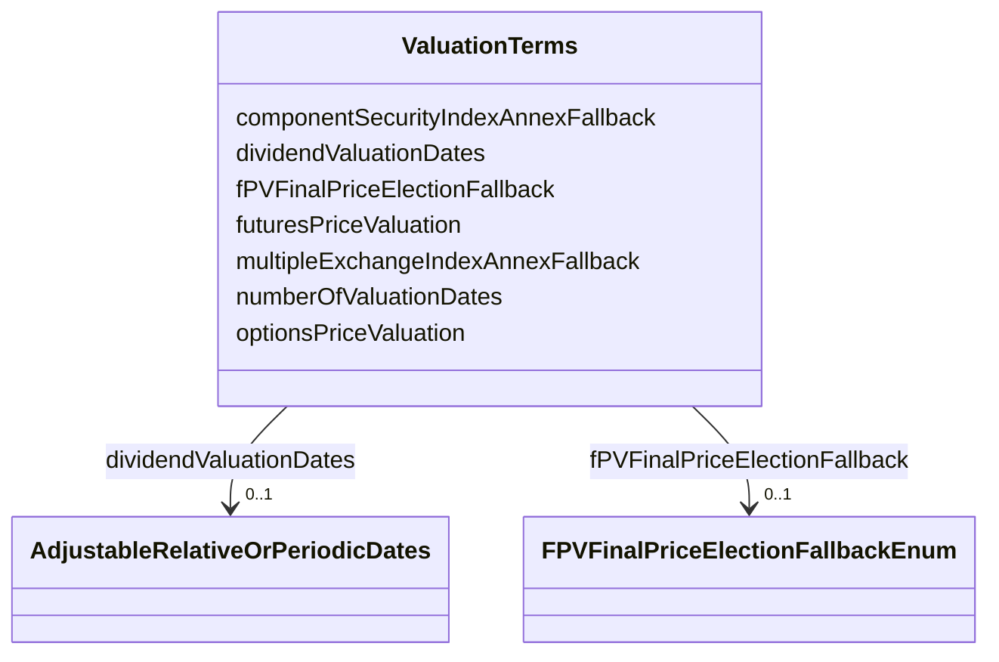

```mermaid
 classDiagram
    class ValuationTerms
    click ValuationTerms href "../ValuationTerms"
      ValuationTerms : componentSecurityIndexAnnexFallback
        
      ValuationTerms : dividendValuationDates
        
          
    
        
        
        ValuationTerms --> "0..1" AdjustableRelativeOrPeriodicDates : dividendValuationDates
        click AdjustableRelativeOrPeriodicDates href "../AdjustableRelativeOrPeriodicDates"
    

        
      ValuationTerms : fPVFinalPriceElectionFallback
        
          
    
        
        
        ValuationTerms --> "0..1" FPVFinalPriceElectionFallbackEnum : fPVFinalPriceElectionFallback
        click FPVFinalPriceElectionFallbackEnum href "../FPVFinalPriceElectionFallbackEnum"
    

        
      ValuationTerms : futuresPriceValuation
        
      ValuationTerms : multipleExchangeIndexAnnexFallback
        
      ValuationTerms : numberOfValuationDates
        
      ValuationTerms : optionsPriceValuation
        
      
```
