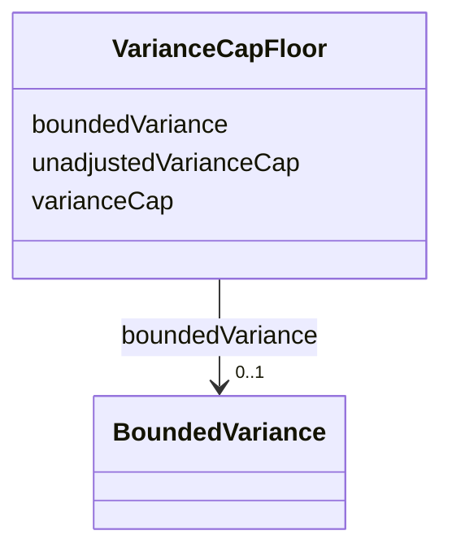

```mermaid
 classDiagram
    class VarianceCapFloor
    click VarianceCapFloor href "../VarianceCapFloor"
      VarianceCapFloor : boundedVariance
        
          
    
        
        
        VarianceCapFloor --> "0..1" BoundedVariance : boundedVariance
        click BoundedVariance href "../BoundedVariance"
    

        
      VarianceCapFloor : unadjustedVarianceCap
        
      VarianceCapFloor : varianceCap
        
      
```
