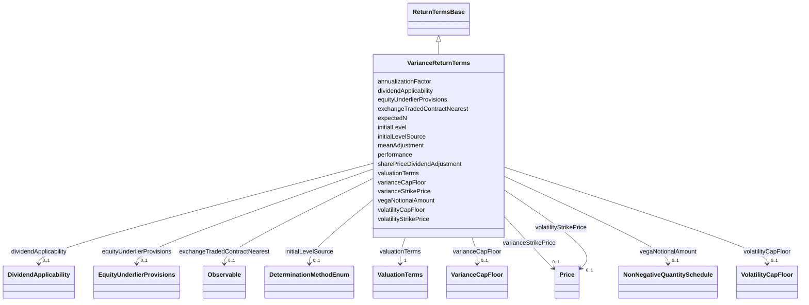

```mermaid
 classDiagram
    class VarianceReturnTerms
    click VarianceReturnTerms href "../VarianceReturnTerms"
      ReturnTermsBase <|-- VarianceReturnTerms
        click ReturnTermsBase href "../ReturnTermsBase"
      
      VarianceReturnTerms : annualizationFactor
        
      VarianceReturnTerms : dividendApplicability
        
          
    
        
        
        VarianceReturnTerms --> "0..1" DividendApplicability : dividendApplicability
        click DividendApplicability href "../DividendApplicability"
    

        
      VarianceReturnTerms : equityUnderlierProvisions
        
          
    
        
        
        VarianceReturnTerms --> "0..1" EquityUnderlierProvisions : equityUnderlierProvisions
        click EquityUnderlierProvisions href "../EquityUnderlierProvisions"
    

        
      VarianceReturnTerms : exchangeTradedContractNearest
        
          
    
        
        
        VarianceReturnTerms --> "0..1" Observable : exchangeTradedContractNearest
        click Observable href "../Observable"
    

        
      VarianceReturnTerms : expectedN
        
      VarianceReturnTerms : initialLevel
        
      VarianceReturnTerms : initialLevelSource
        
          
    
        
        
        VarianceReturnTerms --> "0..1" DeterminationMethodEnum : initialLevelSource
        click DeterminationMethodEnum href "../DeterminationMethodEnum"
    

        
      VarianceReturnTerms : meanAdjustment
        
      VarianceReturnTerms : performance
        
      VarianceReturnTerms : sharePriceDividendAdjustment
        
      VarianceReturnTerms : valuationTerms
        
          
    
        
        
        VarianceReturnTerms --> "1" ValuationTerms : valuationTerms
        click ValuationTerms href "../ValuationTerms"
    

        
      VarianceReturnTerms : varianceCapFloor
        
          
    
        
        
        VarianceReturnTerms --> "0..1" VarianceCapFloor : varianceCapFloor
        click VarianceCapFloor href "../VarianceCapFloor"
    

        
      VarianceReturnTerms : varianceStrikePrice
        
          
    
        
        
        VarianceReturnTerms --> "0..1" Price : varianceStrikePrice
        click Price href "../Price"
    

        
      VarianceReturnTerms : vegaNotionalAmount
        
          
    
        
        
        VarianceReturnTerms --> "0..1" NonNegativeQuantitySchedule : vegaNotionalAmount
        click NonNegativeQuantitySchedule href "../NonNegativeQuantitySchedule"
    

        
      VarianceReturnTerms : volatilityCapFloor
        
          
    
        
        
        VarianceReturnTerms --> "0..1" VolatilityCapFloor : volatilityCapFloor
        click VolatilityCapFloor href "../VolatilityCapFloor"
    

        
      VarianceReturnTerms : volatilityStrikePrice
        
          
    
        
        
        VarianceReturnTerms --> "0..1" Price : volatilityStrikePrice
        click Price href "../Price"
    

        
      
```
