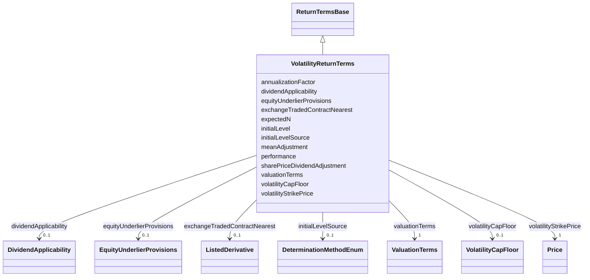

```mermaid
 classDiagram
    class VolatilityReturnTerms
    click VolatilityReturnTerms href "../VolatilityReturnTerms"
      ReturnTermsBase <|-- VolatilityReturnTerms
        click ReturnTermsBase href "../ReturnTermsBase"
      
      VolatilityReturnTerms : annualizationFactor
        
      VolatilityReturnTerms : dividendApplicability
        
          
    
        
        
        VolatilityReturnTerms --> "0..1" DividendApplicability : dividendApplicability
        click DividendApplicability href "../DividendApplicability"
    

        
      VolatilityReturnTerms : equityUnderlierProvisions
        
          
    
        
        
        VolatilityReturnTerms --> "0..1" EquityUnderlierProvisions : equityUnderlierProvisions
        click EquityUnderlierProvisions href "../EquityUnderlierProvisions"
    

        
      VolatilityReturnTerms : exchangeTradedContractNearest
        
          
    
        
        
        VolatilityReturnTerms --> "0..1" ListedDerivative : exchangeTradedContractNearest
        click ListedDerivative href "../ListedDerivative"
    

        
      VolatilityReturnTerms : expectedN
        
      VolatilityReturnTerms : initialLevel
        
      VolatilityReturnTerms : initialLevelSource
        
          
    
        
        
        VolatilityReturnTerms --> "0..1" DeterminationMethodEnum : initialLevelSource
        click DeterminationMethodEnum href "../DeterminationMethodEnum"
    

        
      VolatilityReturnTerms : meanAdjustment
        
      VolatilityReturnTerms : performance
        
      VolatilityReturnTerms : sharePriceDividendAdjustment
        
      VolatilityReturnTerms : valuationTerms
        
          
    
        
        
        VolatilityReturnTerms --> "1" ValuationTerms : valuationTerms
        click ValuationTerms href "../ValuationTerms"
    

        
      VolatilityReturnTerms : volatilityCapFloor
        
          
    
        
        
        VolatilityReturnTerms --> "0..1" VolatilityCapFloor : volatilityCapFloor
        click VolatilityCapFloor href "../VolatilityCapFloor"
    

        
      VolatilityReturnTerms : volatilityStrikePrice
        
          
    
        
        
        VolatilityReturnTerms --> "1" Price : volatilityStrikePrice
        click Price href "../Price"
    

        
      
```
