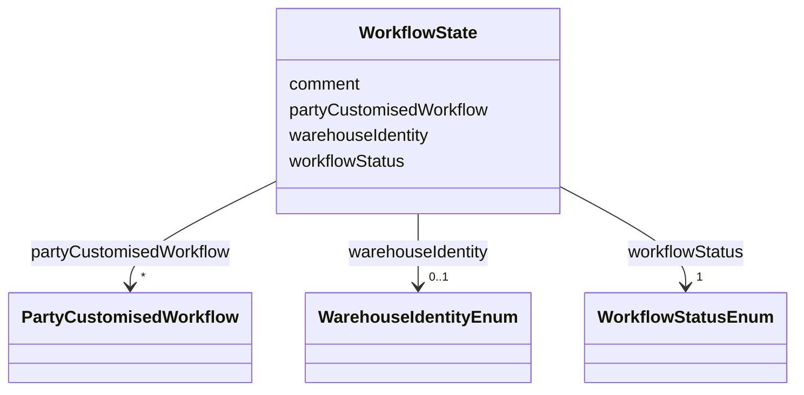

```mermaid
 classDiagram
    class WorkflowState
    click WorkflowState href "../WorkflowState"
      WorkflowState : comment
        
      WorkflowState : partyCustomisedWorkflow
        
          
    
        
        
        WorkflowState --> "*" PartyCustomisedWorkflow : partyCustomisedWorkflow
        click PartyCustomisedWorkflow href "../PartyCustomisedWorkflow"
    

        
      WorkflowState : warehouseIdentity
        
          
    
        
        
        WorkflowState --> "0..1" WarehouseIdentityEnum : warehouseIdentity
        click WarehouseIdentityEnum href "../WarehouseIdentityEnum"
    

        
      WorkflowState : workflowStatus
        
          
    
        
        
        WorkflowState --> "1" WorkflowStatusEnum : workflowStatus
        click WorkflowStatusEnum href "../WorkflowStatusEnum"
    

        
      
```
