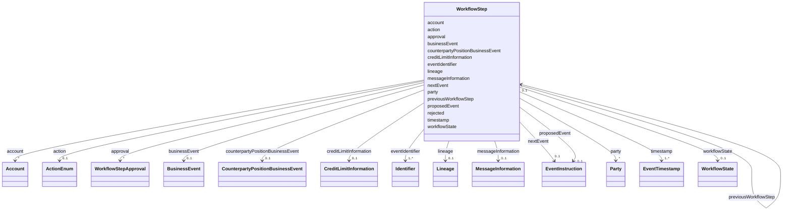

```mermaid
 classDiagram
    class WorkflowStep
    click WorkflowStep href "../WorkflowStep"
      WorkflowStep : account
        
          
    
        
        
        WorkflowStep --> "*" Account : account
        click Account href "../Account"
    

        
      WorkflowStep : action
        
          
    
        
        
        WorkflowStep --> "0..1" ActionEnum : action
        click ActionEnum href "../ActionEnum"
    

        
      WorkflowStep : approval
        
          
    
        
        
        WorkflowStep --> "*" WorkflowStepApproval : approval
        click WorkflowStepApproval href "../WorkflowStepApproval"
    

        
      WorkflowStep : businessEvent
        
          
    
        
        
        WorkflowStep --> "0..1" BusinessEvent : businessEvent
        click BusinessEvent href "../BusinessEvent"
    

        
      WorkflowStep : counterpartyPositionBusinessEvent
        
          
    
        
        
        WorkflowStep --> "0..1" CounterpartyPositionBusinessEvent : counterpartyPositionBusinessEvent
        click CounterpartyPositionBusinessEvent href "../CounterpartyPositionBusinessEvent"
    

        
      WorkflowStep : creditLimitInformation
        
          
    
        
        
        WorkflowStep --> "0..1" CreditLimitInformation : creditLimitInformation
        click CreditLimitInformation href "../CreditLimitInformation"
    

        
      WorkflowStep : eventIdentifier
        
          
    
        
        
        WorkflowStep --> "1..*" Identifier : eventIdentifier
        click Identifier href "../Identifier"
    

        
      WorkflowStep : lineage
        
          
    
        
        
        WorkflowStep --> "0..1" Lineage : lineage
        click Lineage href "../Lineage"
    

        
      WorkflowStep : messageInformation
        
          
    
        
        
        WorkflowStep --> "0..1" MessageInformation : messageInformation
        click MessageInformation href "../MessageInformation"
    

        
      WorkflowStep : nextEvent
        
          
    
        
        
        WorkflowStep --> "0..1" EventInstruction : nextEvent
        click EventInstruction href "../EventInstruction"
    

        
      WorkflowStep : party
        
          
    
        
        
        WorkflowStep --> "*" Party : party
        click Party href "../Party"
    

        
      WorkflowStep : previousWorkflowStep
        
          
    
        
        
        WorkflowStep --> "0..1" WorkflowStep : previousWorkflowStep
        click WorkflowStep href "../WorkflowStep"
    

        
      WorkflowStep : proposedEvent
        
          
    
        
        
        WorkflowStep --> "0..1" EventInstruction : proposedEvent
        click EventInstruction href "../EventInstruction"
    

        
      WorkflowStep : rejected
        
      WorkflowStep : timestamp
        
          
    
        
        
        WorkflowStep --> "1..*" EventTimestamp : timestamp
        click EventTimestamp href "../EventTimestamp"
    

        
      WorkflowStep : workflowState
        
          
    
        
        
        WorkflowStep --> "0..1" WorkflowState : workflowState
        click WorkflowState href "../WorkflowState"
    

        
      
```
