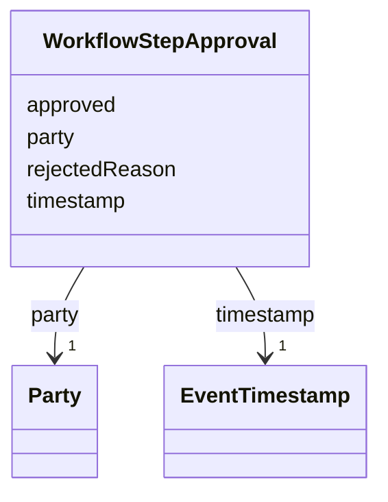

```mermaid
 classDiagram
    class WorkflowStepApproval
    click WorkflowStepApproval href "../WorkflowStepApproval"
      WorkflowStepApproval : approved
        
      WorkflowStepApproval : party
        
          
    
        
        
        WorkflowStepApproval --> "1" Party : party
        click Party href "../Party"
    

        
      WorkflowStepApproval : rejectedReason
        
      WorkflowStepApproval : timestamp
        
          
    
        
        
        WorkflowStepApproval --> "1" EventTimestamp : timestamp
        click EventTimestamp href "../EventTimestamp"
    

        
      
```
